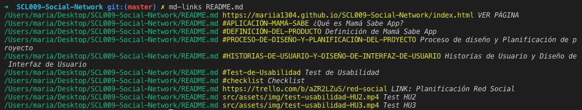
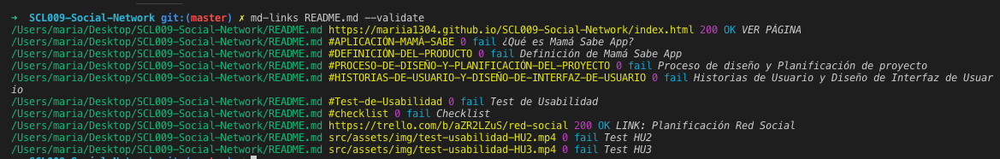
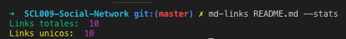
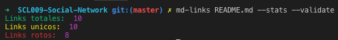

# mariia-md-links

# [Link a librería en NPM](https://www.npmjs.com/package/mariia-md-links)

Permite extraer los links de archivos markdown(.md), validar status de links y obtener algunas estadisticas.

### Instalación:

```sh
npm install mariia-md-links
```
### Uso:

```js
const md-links = require ( 'mariia-md-links' ) ;   
```

### CLI (Command Line Interface - Interfaz de Línea de Comando)

La librería puede ejecutarse de la siguiente
manera a través de la terminal:

`md-links <path-to-file> [options]`

* El modulo capaz de leer archivos con extencion .md y tambien en caso si le pasa el directorio lo puede recorrer buscando archivos con esta extencion.

Por ejemplo:

```sh
$ md-links ./some/example.md
./some/example.md http://algo.com/2/3/ Link a algo
./some/example.md https://otra-cosa.net/algun-doc.html algún doc
./some/example.md http://google.com/ Google
```

El comportamiento de la librería por defecto es identificar el archivo markdown (a partir de la ruta que recibe como argumento), analizar el archivo Markdown e imprimir los links que vaya
encontrando, junto con la ruta del archivo donde aparece y el texto
que hay dentro del link.



#### Options

##### `--validate` o `--v`

Si pasar la opción `--validate` o `--v`, el módulo hace una petición HTTP para
averiguar si el link funciona o no. Si el link resulta en una redirección a una
URL que responde ok, entonces considera el link como ok.

Por ejemplo:

```sh
$ md-links ./some/example.md --validate
./some/example.md http://algo.com/2/3/ ok 200 Link a algo
./some/example.md https://otra-cosa.net/algun-doc.html fail 404 algún doc
./some/example.md http://google.com/ ok 301 Google
```


##### `--stats` o `--s`

Si pasar la opción `--stats` el output será un texto con estadísticas
básicas sobre los links.

```sh
$ md-links ./some/example.md --stats
Total: 3
Unique: 3
```


##### `--stats --validate`

También podemos combinar `--stats`(`--s`) y `--validate`(`--v`) para obtener estadísticas que necesiten de los resultados de la validación.

```sh
$ md-links ./some/example.md --stats --validate
Total: 3
Unique: 3
Broken: 1
```



### Documentación técnica

#### Dependencias:

    "colors": "^1.3.3",
    "eslint": "^5.16.0",
    "eslint-plugin-jest": "^22.6.4",
    "filehound": "^1.17.0",
    "jest": "^24.8.0",
    "link": "^0.1.5",
    "marked": "^0.6.2",
    "node-fetch": "^2.6.0"

### Funciones implementadas:

```js
1.- (Promise)mdLinks(path,options)
```
Retorna una promesa con un arreglo de los links encontrados en ```path```, según las opciones especificadas en 
```options```.

*Parámetros*

- ```path:``` Ruta a un archivo .md (markup) o una carpeta conteniendo archivos .md

- ```options:``` objeto conteniendo las siguientes opciones:

*validate: true o false* Si es true, va a intentar a validar los links (accediendolo a través de internet), va a incluir el status de la conexión(numero) y su statusText(ok o fail).
*stats: true o false*	Si es true, va a contar e imprimir en el terminal algunos estadisticas sobre los links.
- ```Retorno:``` 
Promesa que al resolverse retorna el siguiente arreglo:
```
[
	{
		href:<ruta del link>,
		text:<texto del link>,
		file:<ubicación del archivo que contiene este link>,
		(opcional) status:<código http del status>,
		(opcional) statusText:<texto que representa el status>
	},...
]
```

[link a planificacion del proyecto en trello](https://trello.com/b/jNOLyIu4/md-links)

author: Mariia Chernysheva